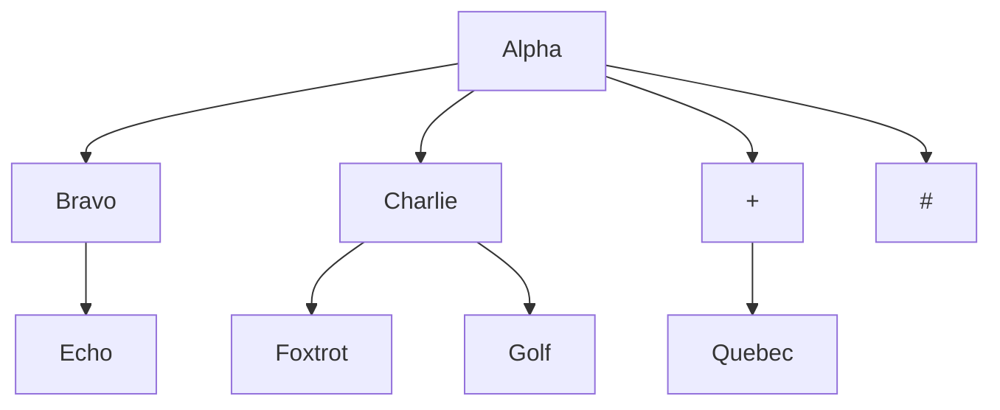

# miqo-topic


If the following topic is subscribed to, a tree structure like the one shown in the diagram is formed.
```
/Alpha/Bravo/Echo
/Alpha/Charlie/Foxtrot
/Alpha/Charlie/Golf
/Alpha/+/Quebec
/Alpha/#

```



Each node may contain a value, assuming in the case of an MQTT broker, it might have a transmission channel.　The same node can hold multiple values. This requirement corresponds to the scenario where multiple clients can subscribe to the same topic.
> [!NOTE]
> Currently, the implementation is using RefCell and Rc, but for multi-threaded implementation, it will be necessary to switch to using Arc.


